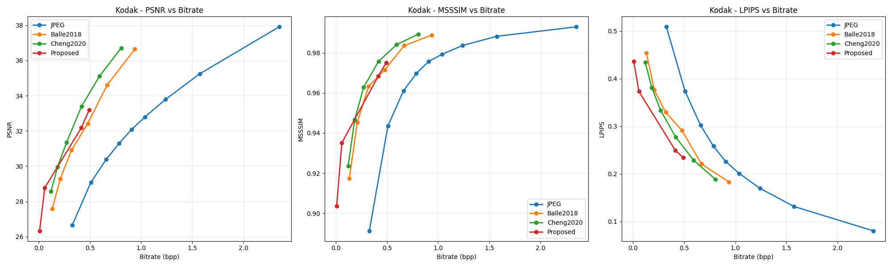
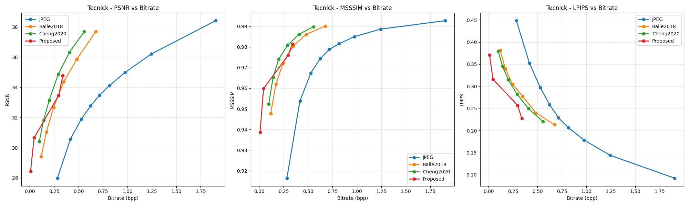

# 🚀 Bi-Mamba: Efficient Bi-Directional State Space Models for Learned Image Compression

---

## 📌 Abstract

Modern Learned Image Compression (LIC) frameworks are predominantly built upon Convolutional Neural Networks (CNNs) or Transformer architectures. While CNNs suffer from limited receptive fields, Transformers incur quadratic computational complexity **O(n²)**, making them computationally expensive for high-resolution inputs.

This repository introduces the **Hierarchical Bidirectional Mamba (BiMamba) Autoencoder**, a novel linear-time State Space Model (SSM)-based architecture for efficient image compression. The proposed framework captures long-range spatial dependencies using bidirectional sequential modeling while maintaining computational efficiency.

BiMamba integrates a joint hyperprior and context-based entropy model to achieve improved rate-distortion performance across multiple bitrates, particularly in low-bitrate regimes (< 0.5 bpp).

---

## 🔥 Key Contributions

- ✅ Bidirectional State Space Modeling for global context learning  
- ✅ Hierarchical multi-scale latent representation  
- ✅ Joint hyperprior + context-dependent entropy modeling  
- ✅ Linear-time computational complexity  
- ✅ Superior perceptual quality at low bitrates (< 0.5 bpp)  
- ✅ Improved LPIPS and MS-SSIM performance compared to conventional baselines  

---

## 📊 Experimental Results

### 📂 Datasets
- Kodak  
- Tecnick  

### 📈 Evaluation Metrics
- PSNR  
- MS-SSIM  
- LPIPS  
- BD-Rate  

BiMamba demonstrates improved perceptual quality compared to:

- JPEG  
- Ballé2018  
- Cheng2020  

Particularly strong performance is observed at bitrates below **0.5 bpp**, where global contextual modeling significantly enhances reconstruction fidelity.

---

## 📈 Rate-Distortion Curves

  

---

## 📁 Repository Structure

model.py # Core BiMamba architecture

train1.py # Training pipeline

test_final_proposed_safe.py # Evaluation script

abla_final.py # Ablation study

phd_work2_final/ │── Average_Results.csv │── Detailed_Results.csv │── Kodak/ │── Tecnick/

⚙️ Installation

conda create -n bimamba python=3.10

conda activate bimamba

pip install torch torchvision numpy matplotlib pandas tqdm
▶️ Training

python train1.py

🧪 Evaluation

python test_final_proposed_safe.py

🧠 Model Overview

The proposed BiMamba architecture consists of:

Hierarchical encoder with bidirectional State Space layers

Multi-scale latent representation

Hyperprior-based entropy modeling

Context-adaptive probability estimation

Rate-distortion optimized training objective

The architecture achieves global spatial awareness while maintaining linear computational complexity O(n).
📄 Citation

If you use this work in your research, please cite:

@article{bimamba2026,

title={Bi-Mamba: Efficient Bi-Directional State Space Models for Learned Image Compression},

author={Renuka Govindaraju and S. Vidhusha},

year={2026} }
License

This project is released under the MIT License.
👩‍🔬 Authors

Renuka Govindaraju

S. Vidhusha
